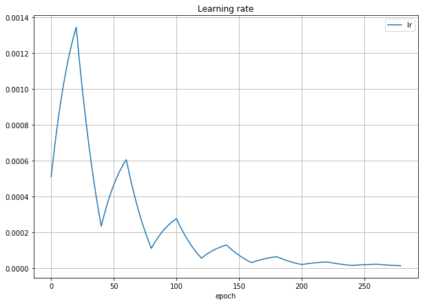
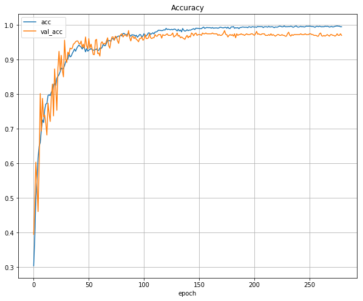
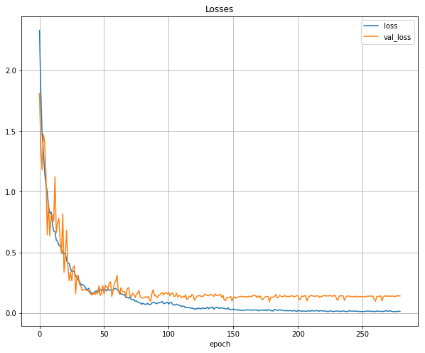

# Image classification

This program was originally done to Kaggle competition where plant seedling photos were categorized to 12 classes according to the plant species. Resnet-50 convolutional neural network is used for the classification task and I used the standard model from the Keras library with just modifying the output layer to 12 classes. Imagenet weights are used as a starting point and I tried training just the new dense layer in the output, but it didn't give good results, so I configured the model so that all layers are trainable. This model reached about 96.5% accuracy in the competition test set. One epoch takes about 125 seconds on GFX1080TI and about 200 epochs are necessary to train the model. 

The model itself is very basic stuff, but this notebook contains few nice features that I want to share. 
* Model training uses generator approach, i.e. the Keras fit_generator calls training and test generators that feed the image and label data to the training process. The architecture was originally developed by Jeremy Howard for Fast.AI courses and I adopted and modified it to better fit this use case. 
* Training image generator uses augmentation features that I've implemented myself. There are basic cropping, stretching, flipping, darken/brighten, color changes, etc. implemented. Many of the augmentation parameters can be modified to find the best amount of augmentation. I have typically run many training iterations to find the best augmentation parameters and usually it works best when there is just enough augmentation so that the train accuracy can go to almost 1.0 but the validation accuracy doesn't start to degrade at the end of the training. If the validation accuracy degrades, the model is overfitting and would need more augmentation. If the accuracy is bad, try reducing augmentation. With this Kaggle seedling dataset almost every training image needs some sort of augmentation. 
* The training uses ModelCheckpoint callback to save the model always when validation loss reaches new lowest point. That can save lot of time if the model happens to overfit badly at the end of the training but the 'sweet spot' could be still usable. 
* I implemented callback function for custom learning rate. Keras gives epoch number to the callback function and the function calculates new learning rate from the epoch. There are two modes: cyclic decaying and smooth decaying learning rate. I found that cyclic mode works quite nicely and could speed up the training. 
* There is callback function that stores the training and validation loss and accuracy data per epoch and produces live graphs during the training. That can help a __lot__ in the training monitoring, since it is way easier to visually check the curves instead of comparing hundreds of rows of decimal numbers. 

Here is example of cyclic learning rate that can be produced using the callback: 

And here are examples of the training and validation loss & accuracy curves that are plotted during the model training. The cyclic learning rate from above plot was used in this training.  

The code is tailored for small datasets that fit to the RAM during the training. For larger datasets one may need to modify the training data generators so that those read the image data from disk. In that case just store the file names in memory and read the files according to the indices given by the BatchIndices instance. 

